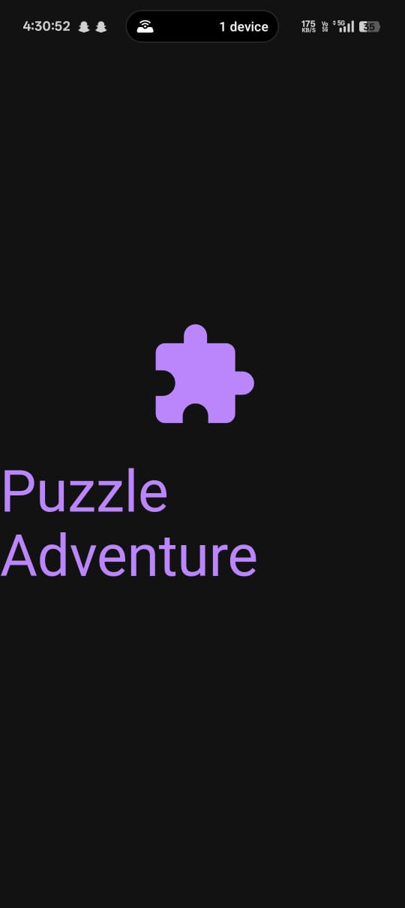
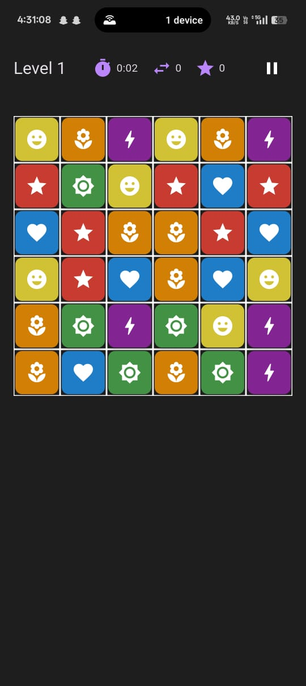
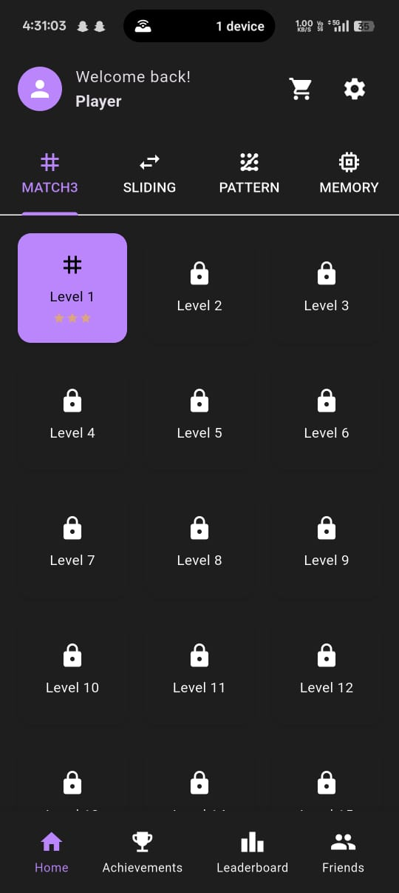
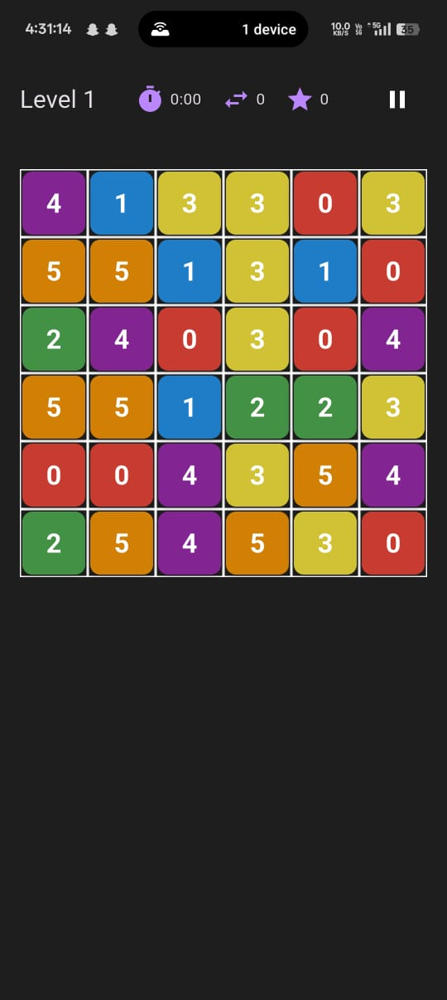

# Puzzle Adventure

A beautiful and challenging mobile puzzle game blending match-3, sliding puzzles, pattern recognition, and memory challenges. Built with Flutter.

---

## ✨ Features

- **Multiple Puzzle Types:**  
  Enjoy match-3, sliding, pattern, and memory puzzles—all in one app.
- **Interactive Tutorial:**  
  New users are guided through all mechanics on first launch.
- **Modern UI:**  
  Clean, responsive, and touch-friendly design.
- **Cross-Platform:**  
  Runs on Android, iOS, and web (via Flutter).

---

## 📸 Screenshots

<p align="center">
  
  
  
  
</p>

---

## 🚀 Getting Started

### Prerequisites

- [Flutter SDK](https://flutter.dev/docs/get-started/install)
- Android Studio, VS Code, or any Flutter-compatible IDE

### Installation

```sh
git clone https://github.com/krutpanda/Puzzle-Adventure.git
cd Puzzle-Adventure
flutter pub get
```

### Running the App

```sh
flutter run
```

### Building APK

```sh
flutter build apk
```

---

## 📁 Assets

All game assets and screenshots are located in the `assets/` directory.

---

## ❓ FAQ

<details>
<summary><strong>What platforms does Puzzle Adventure support?</strong></summary>
<p>Puzzle Adventure is built with Flutter and runs on Android, iOS, and the web.</p>
</details>

<details>
<summary><strong>How do I play the different puzzle types?</strong></summary>
<p>The game features an interactive tutorial on first launch that introduces you to match-3, sliding, pattern, and memory puzzles. Each level may feature a different mechanic!</p>
</details>

<details>
<summary><strong>Can I contribute new puzzle types or features?</strong></summary>
<p>Absolutely! Please open an issue to discuss your idea, or submit a pull request with your proposed changes.</p>
</details>

<details>
<summary><strong>Where are the game assets and screenshots?</strong></summary>
<p>All assets and screenshots are located in the <code>assets/</code> directory.</p>
</details>

<details>
<summary><strong>How do I report a bug or request a feature?</strong></summary>
<p>Please use the <a href="https://github.com/krutpanda/Puzzle-Adventure/issues">GitHub Issues</a> page for bug reports and feature requests.</p>
</details>

---

## 🗺️ Roadmap

- [x] Core game engine and logic
- [x] Match-3, sliding, pattern, and memory puzzle types
- [x] Interactive tutorial for new users
- [x] Modern, responsive UI
- [x] Cross-platform support (Android, iOS, web)
- [x] Screenshot and asset management
- [ ] Level progression and unlock system
- [ ] Sound effects and music enhancements
- [ ] Leaderboards and achievements
- [ ] More puzzle types and challenges
- [ ] Localization (multi-language support)
- [ ] In-app hints and help system
- [ ] App store release

---

## 🤝 Contributing

We welcome contributions from the community! If you have ideas for new features, improvements, or bug fixes, please open an issue or submit a pull request. For major changes, start a discussion first to ensure alignment with the project vision.

---

## 📜 License

This project is for demonstration and educational purposes.

---

## 🙏 Credits

- Developed by [krutpanda](https://github.com/krutpanda)
- Built with [Flutter](https://flutter.dev/)
